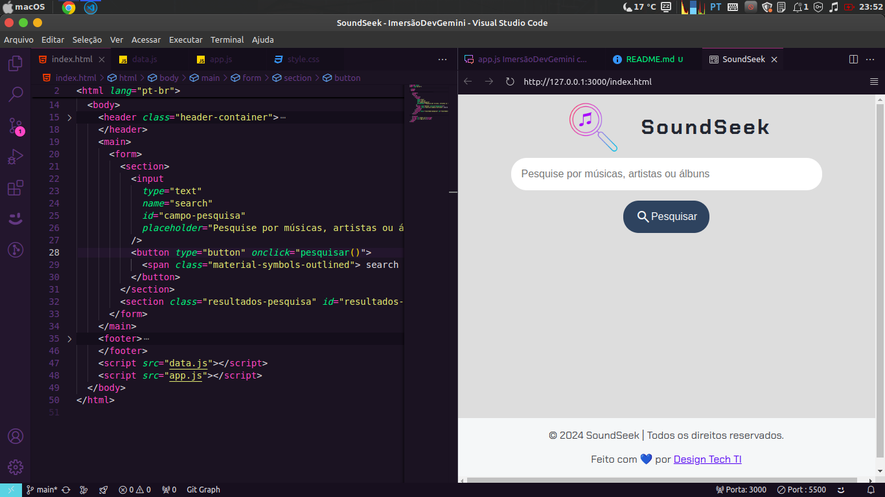

# 🎵 SoundSeek: Seu Buscador Musical Favorito! 🎶

E aí, galera do código! Bem-vindos ao projeto mais musical da ImersãoDevGemini! 🚀

## 🤔 O que é isso?

Imagine só: você tá com aquela música na ponta da língua, mas não lembra o nome. Ou quer descobrir mais sobre seu artista favorito. É aí que a gente entra! Este projeto é um buscador musical que vai te salvar dessas situações embaraçosas em festas e reuniões de família. 😎

## 🛠️ Tecnologias Usadas

Segura essa playlist de tecnologias que a gente usou:

- **HTML**: O esqueleto da nossa página, mais estruturado que setlist de show.
- **CSS**: Pra deixar tudo bonito e estiloso, tipo um clipe do Michael Jackson.
- **JavaScript**: O maestro que rege toda a orquestra do nosso código.

## 🎸 Funcionalidades

- **Busca Poderosa**: Digite qualquer coisa relacionada à música (artista, música, álbum) e veja a mágica acontecer!
- **Exibição Detalhada**: Mostra tudo sobre a música, desde a letra até o ano de lançamento. É tipo ter um especialista musical no bolso!
- **Links para Streaming**: Spotify, Apple Music, Deezer, YouTube Music... É só escolher sua plataforma favorita e dar o play!

## 🚀 Como Usar

1. Clone este repositório (ou baixe o ZIP, a gente não julga).
2. Abra o `index.html` no seu navegador preferido.
3. Digite algo no campo de busca e clique em "Pesquisar".
4. Voilà! Resultados musicais na sua tela mais rápido que um solo de guitarra!

## 🤓 Detalhes Técnicos para os Curiosos

- Usamos JavaScript puro, sem frescuras de frameworks. Old school é o novo cool!
- A função `pesquisar()` é o coração do projeto. Ela vasculha nossa base de dados musical como se fosse um DJ procurando a próxima faixa.
- Trabalhamos com manipulação do DOM para exibir os resultados. É tipo mágica, só que com código!

&nbsp;
&nbsp;
&nbsp;
&nbsp;
&nbsp;

## Link do projeto

## 🎉 Conclusão

Este projeto é mais divertido que um karaokê em família! Esperamos que você curta usar tanto quanto a gente curtiu criar. E lembre-se: em caso de dúvidas musicais, não chame o Shazam, use o SoundSeek! 🎤🎶

Feito com 🎵 e muito ☕ pelo [Design Tech TI](https://designtechti.github.io/devlinks)!
